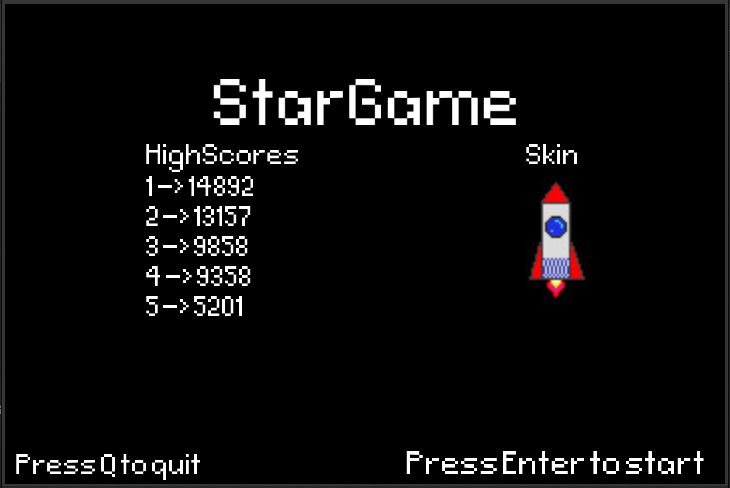
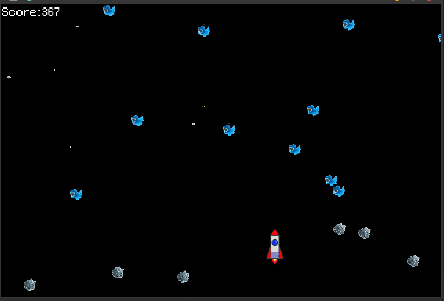
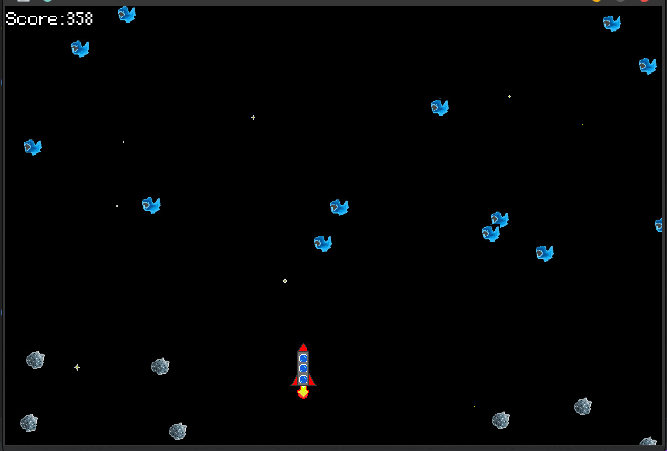

# StarGame

Simple game written in C++11 with OpenGL 3.3  
Used OOP as base code style

### Used Libraries:

- GLFW (Base OpenGl Window Creator)
- GLEW (OpenGL functions wrapper)
- GLM (OpenGL Mathematics library)
- Freetype2 (Text Render)
- SOIL (Loader Image into Textures)

### How to Play

    ./StarGame //linux

Use arrow keys left ( < ) and right ( > ) to move rocket.  
Space to shoot.   
In game use Esc to stop game  

In menu use Enter to play Game  
Use H to show help message  
Use Q to quit  

In menu use number keys (1 - 4) to change rocket skin  

### Screenshots

